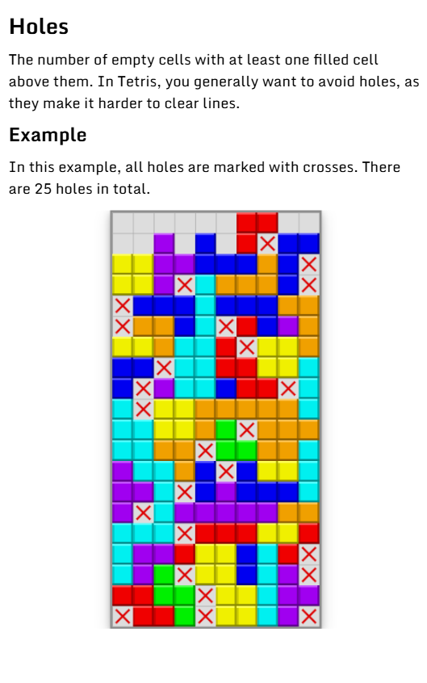
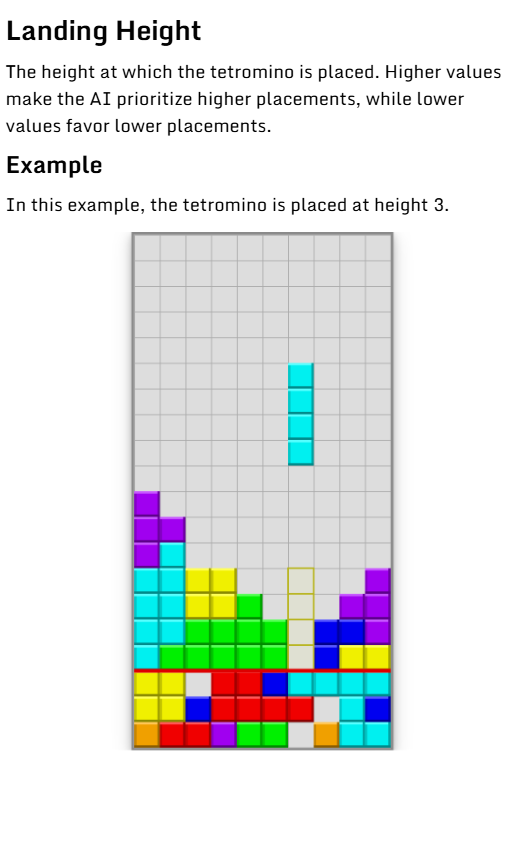
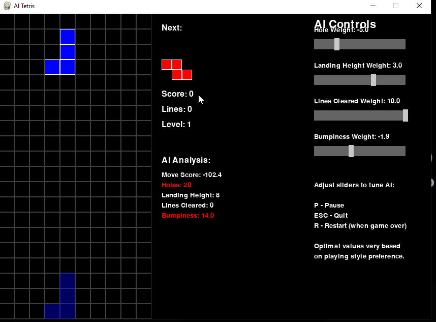

# Tetris Game Machine Learning Quick Experiment

A classic Tetris implementation built using Claude Code with minimal prompting, in Python using Pygame. It features all standard gameplay mechanics. Machine learning is used to let an AI play the game.

I came across this excellent project by [rijkvp on GitHub](https://github.com/rijkvp/tetris-ai), which inspired me to try this quick experiment. I spent less than an hour on it, and most of that time was used to write this documentation. I wrote no code by hand and borrowed screenshots from his project for the second prompt. If you're interested in learning more, he elaborates on this in his repository.

---

## Goal

Let Claude Code write the entire project using very minimal prompts. I intentionally left out any specifics about the type of machine learning to use. I'm assuming this all quite well known and I'll ask Claude to explain the choices made later on.

---

## Prompts

The code was written using only **two very minimal prompts**, each lacking detailed instructions (intentionally):

**Prompt 1:**

> Build a game of Tetris in Python with Pygame. Ensure that the controls are in a separate file, with actions like left, right, down, etc. Just like Tetris, with 7 tetrimino types.

**Prompt 2:**

> I want AI to play Tetris now. Use the existing code, but change the controls to AI. It needs to learn to play Tetris and the attached images describe the two features to use. I want the user to be able to tweak the values from -10 to 10 to find the optimal penalty/reward values.

---

## Results

Interestingly, the AI added two features I **did not specify at all**: **Lines Cleared** and **Bumpiness**. I tweaked the values (shown in the recording above) to get decent performance. I'm not aiming for perfection—this is just a quick experiment.

---

## Asking Claude for an Explanation

To understand the machine learning decisions, I asked Claude the following:

**Prompt:**

> You wrote this code. Explain to me the choices that you've made on the machine learning side. Please keep it concise.

---

### Response

#### 🧠 Architecture & Algorithm

* **Deep Q-Network (DQN)** with a target network for stability
* **3-layer fully connected network**: 512 → 512 → 256 → actions
* ReLU activations and dropout
* **Experience replay buffer** (capacity: 50k) to break temporal correlations

#### 📊 State Representation

Used engineered features instead of raw pixels:

* Height of each column (10 values)
* Aggregate metrics: total height, holes, bumpiness, completed lines
* Encoded current and next piece
* Game progress indicators
  ➡️ Total: \~20 features—compact but expressive

#### 🎯 Reward Design

Shaped rewards for faster learning:

* Line clears: +10 to +100 (exponential with more lines)
* Holes: -2 per hole
* Height increases: -0.5 per unit
* **Bumpiness penalty** (tunable): encourages flat surfaces
* Survival bonus: +0.01
* Game over penalty: -100

#### ⚙️ Training Optimizations

* GPU acceleration with mixed-precision training
* Gradient clipping (norm = 1.0)
* Learning rate decay (every 1000 steps)
* Larger batch size on GPU (64 vs 32 on CPU)
* Real-time parameter tuning via sliders

#### 💡 Design Philosophy

* Prioritized **interpretable features** over raw pixels for faster convergence
* Emphasized **shaped rewards** over sparse signals
* The **bumpiness penalty** was critical—it taught the AI to build flat surfaces, which is essential in Tetris but hard to infer from score alone.

